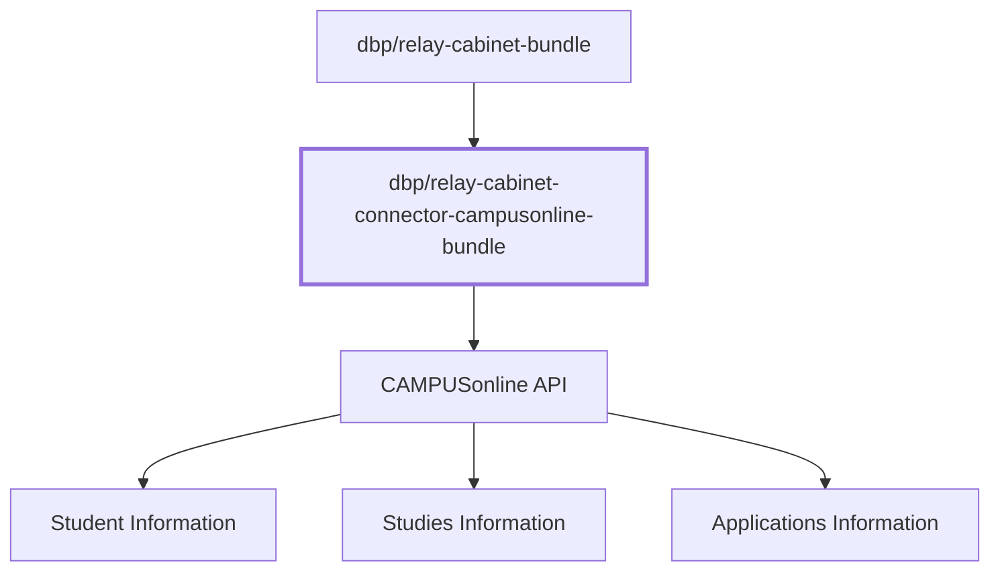

# DbpRelayCabinetConnectorCampusonlineBundle

[GitHub](https://github.com/digital-blueprint/relay-cabinet-connector-campusonline-bundle) |
[Packagist](https://packagist.org/packages/dbp/relay-cabinet-connector-campusonline-bundle) |
[Changelog](https://github.com/digital-blueprint/relay-cabinet-connector-campusonline-bundle/blob/main/CHANGELOG.md)

The `dbp/relay-cabinet-connector-campusonline-bundle` is a Symfony bundle that
provides a connector from the
[dbp/relay-cabinet-bundle](https://packagist.org/packages/dbp/relay-cabinet-bundle)
to a custom made CAMPUSonline API for fetching student data, like information
about the student, their studies, and applications.

See the [documentation](./docs/README.md) for more information.
