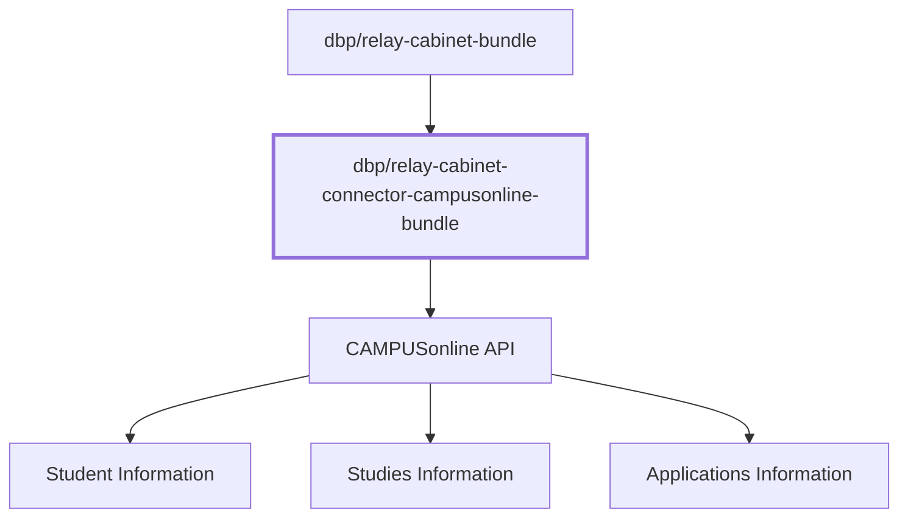

# Overview

The `dbp/relay-cabinet-connector-campusonline-bundle` is a Symfony bundle that
provides a connector from the
[dbp/relay-cabinet-bundle](https://packagist.org/packages/dbp/relay-cabinet-bundle)
to a custom-made CAMPUSonline API for fetching student data, such as information
about all students, their studies, and their applications.

The connector depends on a custom made CO API for efficiently fetching student
data including incremental updates.

## Documentation

* [Bundle Configuration](./config.md)
* [Provided Student Data](./data.md)
* [CAMPUSonline API Details](./co-api.md)
