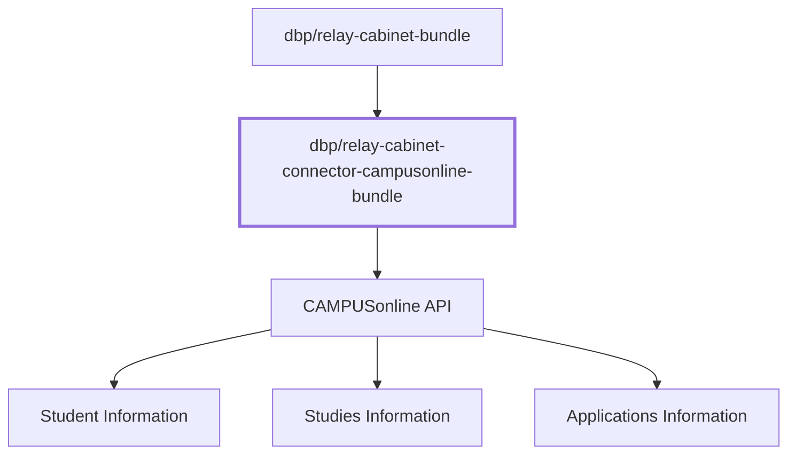

# Overview

The `dbp/relay-cabinet-connector-campusonline-bundle` is a Symfony bundle that
provides a connector from the
[dbp/relay-cabinet-bundle](https://packagist.org/packages/dbp/relay-cabinet-bundle)
to a custom made CAMPUSonline API for fetching student data, like information
about the student, their studies, and applications.



## Config

Created via `./bin/console config:dump-reference dbp_relay_cabinet_connector_campusonline | sed '/^$/d'`

```yaml
dbp_relay_cabinet_connector_campusonline:
  # The base URL of the CO instance
  api_url:              ~ # Required, Example: 'https://online.mycampus.org/campus_online'
  # The OAuth2 client ID
  client_id:            ~ # Required, Example: my-client
  # The OAuth2 client secret
  client_secret:        ~ # Required, Example: my-secret
  # The data service name for the Student CO API
  data_service_name_students: ~ # Required, Example: loc_api-dms.dmsstudents
  # The data service name for the Studies CO API
  data_service_name_studies: ~ # Required, Example: loc_api-dms.dmsstudies
  # The data service name for the Applications CO API
  data_service_name_applications: ~ # Required, Example: loc_api-dms.dmsapplicants
  # Set to exclude inactive students and studies (useful for testing with less data)
  exclude_inactive:     false # Example: 'true'
  # Enable caching for easier development
  cache:                false # Example: 'true'
  # The page size used for CO requests
  page_size:            20000
```

## Commands

These `show-*` commands print a table of a particular student, their studies, or
their application. The format is the one returned by the CAMPUSonline API as is.

```
dbp:relay:cabinet-connector-campusonline:show-applications  Show applications of a student
dbp:relay:cabinet-connector-campusonline:show-student       Show student data for an obfuscated ID
dbp:relay:cabinet-connector-campusonline:show-studies       Show studies for an obfuscated ID
```

The `sync-one` command will print all related data for a particular student as
JSON. This is the format used which is forwarded to the `dbp/relay-cabinet-bundle`.

```
dbp:relay:cabinet-connector-campusonline:sync-one           Show JSON for an obfuscated ID
```

The `sync` command fetches all students and converts them to JSON, but does not
print anything.

```
dbp:relay:cabinet-connector-campusonline:sync               Run a sync
```
