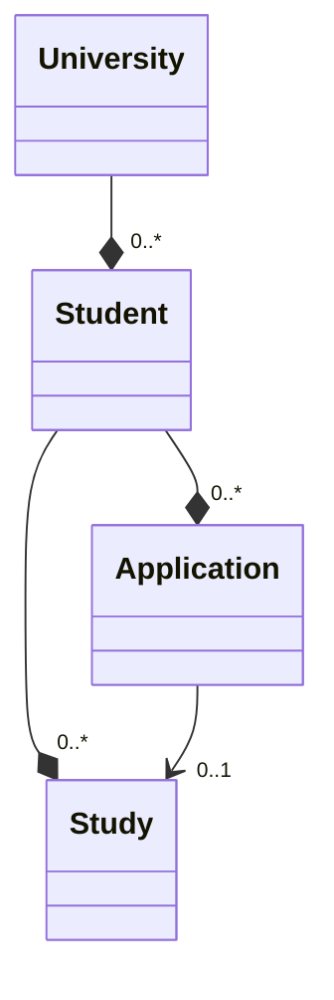

# CAMPUSonline API

For efficient data exchange between CAMPUSonline and the CAMPUSonline connector,
the connector uses a custom created API which allows us to sync changes
incrementally. There is no way to detect removed entries incrementally, so a
full sync is still needed from time to time.

The CO API provides information about students, their studies, and applications,
which we convert into a list of students with embedded studies and applications:



TODO: Add instructions for how to configure/setup the API in CAMPUSonline.

## CO API related Commands

These `show-*` commands print a table of a particular student, their studies, or
their application. The format is the one returned by the CAMPUSonline API as is.

```
dbp:relay:cabinet-connector-campusonline:show-applications  Show applications of a student
dbp:relay:cabinet-connector-campusonline:show-student       Show student data for an obfuscated ID
dbp:relay:cabinet-connector-campusonline:show-studies       Show studies for an obfuscated ID
```

## General API

Input query parameters:

* `StPersonNr` (optional): The person number of the student, to fetch only records for this student
* `LastSyncDate` (optional): Time of the last sync to get an incremental update,
  format `DD.MM.YYYYTHH:MI:SS` (Timezone is the CO server timezone)
* `PageNr` (optional): The page number to fetch
* `PageSize` (optional): The number of entries per page, 20000 is a good
  default, depending on the server configuration.

Result:

* `SOURCE`: Starts with `LiveSync` if the entry is live from the real DB and not
  from a view. Results can have a mix of different sources.
* `TIMESTAMP`: The timestamp when the entry was read from the live DB, format
  `DD.MM.YYYYTHH:MI:SS` (Timezone is the CO server timezone)

### Students API

URL: `<co>/pl/rest/loc_api-dms.dmsstudents`

Additional input query parameters:

* `IdentNrObfuscated` (optional): The obfuscated identification number of the
  student, to fetch only one record for this student
* `SyncOnlyInactive` (optional): If set to `YES`, only inactive students are
  returned. By default only active students are returned

### Studies API

URL: `<co>/pl/rest/loc_api-dms.dmsstudies`

* `StStudiumNr` (optional): The obfuscated identification number of the
  student, to fetch only one record for this student
* `SyncOnlyInactive` (optional): If set to `YES`, only inactive studies are
  returned. By default only active studies are returned.

### Applications API

URL: `<co>/pl/rest/loc_api-dms.dmsapplicants`

* `StStudiumNr` (optional): The obfuscated identification number of the
  student, to fetch only one record for this student

## Syncing Strategy used by the Connector

We use a combination of full and incremental syncs to keep the data up to date.
The API doesn't provide a way to detect removed entries and doesn't provide
incremental changes for inactive entries, so we need to do a full sync once in a
while (for example once every night).

First we sync all the data paginated.

* Sync all active students
* Sync all inactive students
* Sync all active studies
* Sync all inactive studies
* Sync all active applications

For the active students we remember the timestamp of any entry that is returned
that has not "SOURCE" starting with "LiveSync". Since the active result can also
contain live entries for entries that got added since the last view was created
or they moved active to inactive, and we need to ignore those.

Then we sync the changes incrementally:

* Sync all active students with LastSyncDate=timestamp
* Sync all studies for the changed students
* Sync all applications for the changed students

We remember again the timestamp of any entry that is returned that has not
"SOURCE" starting with "LiveSync" for the next sync. For all live entries we get
back, we store them with their timestamp, since they could be newer then future
view results. We remove them once the non-live view results have a newer
timestamp.

In case too many active students have changed, we fall back to a full sync.

To test the sync you can use the `sync` command which fetches all students and
converts them to JSON, but only prints a short summary and no JSON data. It
stores the sync cursor in the local cache, so the next sync will be incremental,
unless `--full` is passed.

```
dbp:relay:cabinet-connector-campusonline:sync               Run a sync
```

### Single Student Sync

We simply fetch the student with the given `StPersonNr` and `IdentNrObfuscated`
and the related studies and applications. We store the (live) student entries
for the next incremental sync, so any view results that are older then the live
results are ignored and we don't "go back in time".

To test the sync you can use the `sync-one` command which will print all related
data for a particular student as JSON. This is the format used which is
forwarded to the `dbp/relay-cabinet-bundle`.

```
dbp:relay:cabinet-connector-campusonline:sync-one           Show JSON for an obfuscated ID
```

## FAQ

**What are active and inactive students?**

This is just a way to partition the data into two groups to limit the
incremental sync to students which are more likely to change. Active students
currently are students that are not exmatriculated, but it's up to the CO API to
decide.

**How long until changes in CO are visible via the connector?**

Up to 15 minutes (the material view interval on the CO side) + the interval
configured in the connector bundle for incremental syncs. In case of new
students and students that moved from active to inactive we get the data right
away, so only the bundle sync interval applies. Changes to inactive students
will only be visible after the next full sync.
